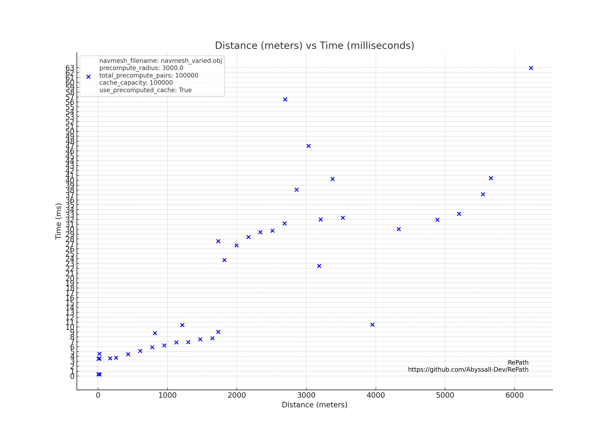
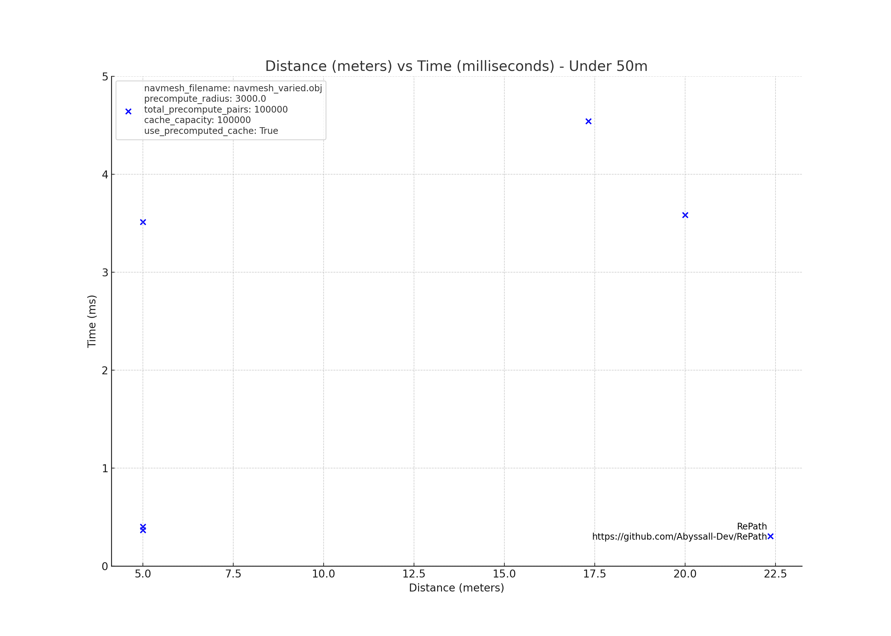

# RePath

[](https://crates.io/crates/repath)
[](https://docs.rs/repath/0.0.9/repath/)
[](https://github.com/Abyssall-Dev/RePath/actions/workflows/rust.yml)

RePath is a fast and efficient pathfinding library. It leverages the A* algorithm to provide rapid and precise pathfinding solution on OBJ navmeshes, essential for managing large numbers of NPCs in real-time environments.

RePath was developed for [Respark](https://playrespark.com/), an upcoming open world MMO shooter. Respark combines intense combat, strategic gameplay, and a vast, dynamic world to explore. Join our community on [Discord](https://discord.gg/8qzSGyekVJ) to stay updated with the latest news and development progress.

## Description

RePath was developed to address the need for high-performance pathfinding in an MMO game server. Given the complexity and size of game worlds, pathfinding can be a significant bottleneck. RePath optimizes this process through a combination of precomputation, caching, and advanced search algorithms, ensuring quick and accurate pathfinding even in demanding scenarios. It can also be used in other applications requiring efficient pathfinding, such as robotics, simulation, and AI.

### Why It's Fast

RePath's speed comes from its combination of precomputation, efficient search algorithms, and intelligent caching. By precomputing paths and storing them in an LRU cache, RePath can quickly return results for common pathfinding queries without recalculating.

## Features

- **A\* Pathfinding Algorithm**: Efficient and accurate pathfinding.
- **Precomputation**: Quickly precomputes random paths in parallel using [Rayon](https://crates.io/crates/rayon) and stores them in a cache.
- **LRU Cache**: Efficient memory usage and quick access to recent paths.
- **Scalable**: Handles large game worlds and numerous NPCs.
- **Multithreading**: Utilizes multiple threads for both precomputation and pathfinding.

## Usage

### Adding RePath to Your Project

Add RePath to your `Cargo.toml`:

```toml
[dependencies]
repath = "0.0.9"
```

Make sure you have the OBJ file containing the navmesh in the same directory as your project.

Then use it in your project:

```rust
use repath::{RePathfinder, settings::RePathSettings};

fn main() {
    // Create a new RePathSettings instance with custom settings
    let settings = RePathSettings {
        navmesh_filename: "navmesh_varied.obj".to_string(), // Path to the navmesh file in Wavefront OBJ format
        precompute_radius: 25.0, // Higher this value, the longer it takes to precompute paths but faster pathfinding for long distances
        total_precompute_pairs: 1000, // Higher this value, the longer it takes to precompute paths but faster pathfinding
        cache_capacity: 1000, // Higher this value, the more paths can be stored in cache but more memory usage
        use_precomputed_cache: true, // Set to false to disable precomputation of paths
    };

    // Create a new RePathfinder instance
    let pathfinder = RePathfinder::new(settings);

    // Define start and end coordinates for pathfinding
    let start_coords = (0.0, 0.0, 0.0);
    let end_coords = (10.0, 10.0, 10.0);

    // Find a path from start to end coordinates using single thread (good for short distances)
    if let Some(path) = pathfinder.find_path(start_coords, end_coords) {
        println!("Found path: {:?}", path);
    } else {
        println!("No path found.");
    }

    // Find a path from start to end coordinates using multiple threads (good for long distances)
    // This should not be used for short distances as it can be slower than single thread because of segmentation and multithreading overhead
    let segment_count = 2; // Splits the path into two segments and calculates them in parallel
    if let Some(path) = pathfinder.find_path_multithreaded(start_coords, end_coords, segment_count) {
        println!("Found path: {:?}", path);
    } else {
        println!("No path found.");
    }
}
```

### Benchmark - Single Threaded Pathfinding

The following graphs show the performance of RePath in pathfinding scenarios. The benchmark was conducted on i7-9700K CPU with 16GB DDR4 RAM with these settings:

- Navmesh Size: 4000 x 4000 meters
- Navmesh Vertices: 40 401
- Navmesh Faces: 80 000
- Precompute Radius: 3 000 meters
- Total Precompute Pairs: 100 000
- Cache Capacity: 100 000
- Use Precomputed Cache: true

## Distance vs Time



## Distance vs Time (Distances under 50 meters)



Results can vary a lot, depending if the path was already cached or not. In short, the more paths were found, the faster the pathfinding will be in the future.

Precomputation is experimental right now and it seems the benefits are not that big, because on large maps it's very unlikely that the same path will be found again. However, it can be useful for small maps or navmeshes with smaller number of vertices and faces. For short distances you can get a sub-millisecond pathfinding time.

You can use `find_path_multithreaded` method to calculate paths in parallel. This is useful for long distances, but it's not recommended for short distances because of the overhead of splitting the path into segments and calculating them in parallel.

### License

RePath is licensed under the MIT License. See the [LICENSE](LICENSE) file for details.
